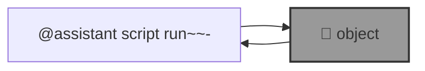

# 🌀 blue-assistant

🌀 `@assistant` is an AI assistant.

```bash
pip install blue-assistant
```


```mermaid
graph LR
    assistant_script_run["@assistant script run~~- <object-name>"]

    object["📂 object"]:::folder

    object --> assistant_script_run
    assistant_script_run --> object

    classDef folder fill:#999,stroke:#333,stroke-width:2px;
```

---

--signature--