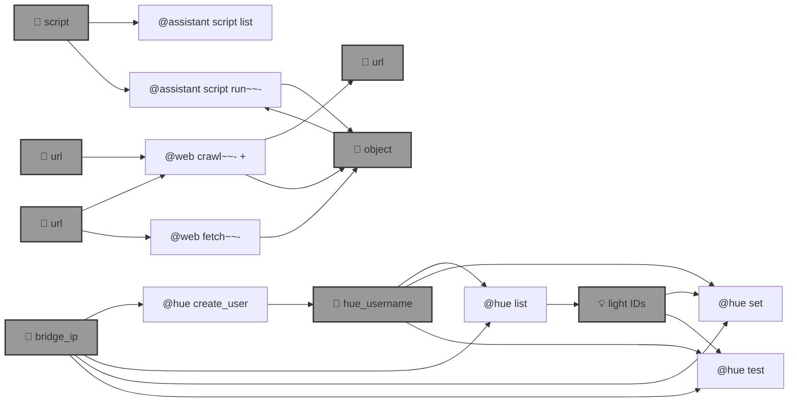

# 🧠 blue-assistant

🧠 `@assistant` runs AI scripts; DAGs that combine deterministic and AI operations.

```bash
pip install blue-assistant
```


```mermaid
graph LR
    assistant_script_list["@assistant script list"]
    assistant_script_run["@assistant script run~~- <script> <object-name>"]

    web_crawl["@web crawl~~- <url-1>+<url-2> <object-name>"]

    web_fetch["@web fetch~~- <url> <object-name>"]

    script["📜 script"]:::folder
    url["🔗 url"]:::folder
    url2["🔗 url"]:::folder
    url3["🔗 url"]:::folder
    object["📂 object"]:::folder


    script --> assistant_script_list

    script --> assistant_script_run
    object --> assistant_script_run
    assistant_script_run --> object

    url --> web_crawl
    url2 --> web_crawl
    web_crawl --> url3
    web_crawl --> object

    url --> web_fetch
    web_fetch --> object

    bridge_ip["🔗 bridge_ip"]:::folder
    hue_username["🔗 hue_username"]:::folder
    list_of_lights["💡 light IDs"]:::folder

    hue_create_user["@hue create_user"]
    hue_list["@hue list"]
    hue_set["@hue set"]
    hue_test["@hue test"]

    bridge_ip --> hue_create_user
    hue_create_user --> hue_username

    bridge_ip --> hue_list
    hue_username --> hue_list
    hue_list --> list_of_lights

    bridge_ip --> hue_set
    hue_username --> hue_set
    list_of_lights --> hue_set

    bridge_ip --> hue_test
    hue_username --> hue_test
    list_of_lights --> hue_test


    classDef folder fill:#999,stroke:#333,stroke-width:2px;
```

items:::

---

signature:::