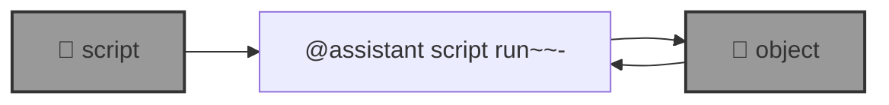

# 🧠 blue-assistant

🧠 `@assistant` is an AI assistant.

```bash
pip install blue-assistant
```


```mermaid
graph LR
    assistant_script_run["@assistant script run~~- <script> <object-name>"]

    script["📜 script"]:::folder
    object["📂 object"]:::folder

    script --> assistant_script_run
    object --> assistant_script_run
    assistant_script_run --> object

    classDef folder fill:#999,stroke:#333,stroke-width:2px;
```

---

--signature--